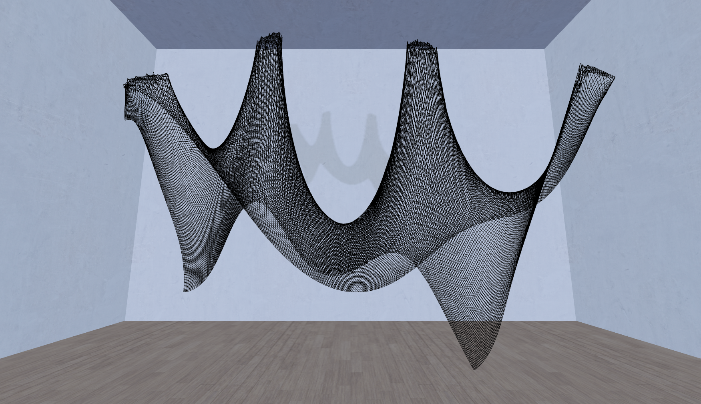
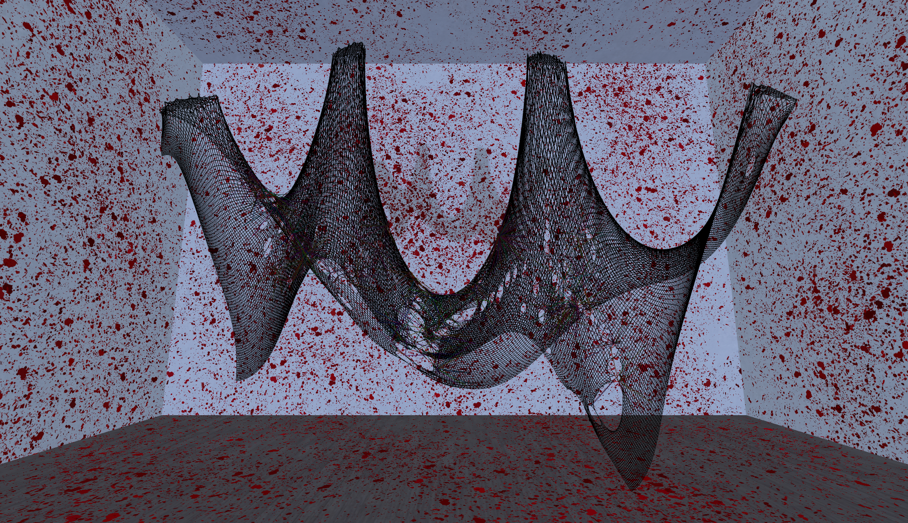

stitchmeat

// virtual art installation

* verlet integration cloth simulation
* quadtree spatial partition optimization
* GLSL shaders for realistic visual effects
* three.js for 3d rendering

https://lucas-wng.github.io/stitchmeat/
(chrome is better for performance)
